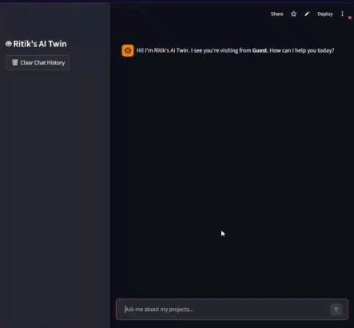
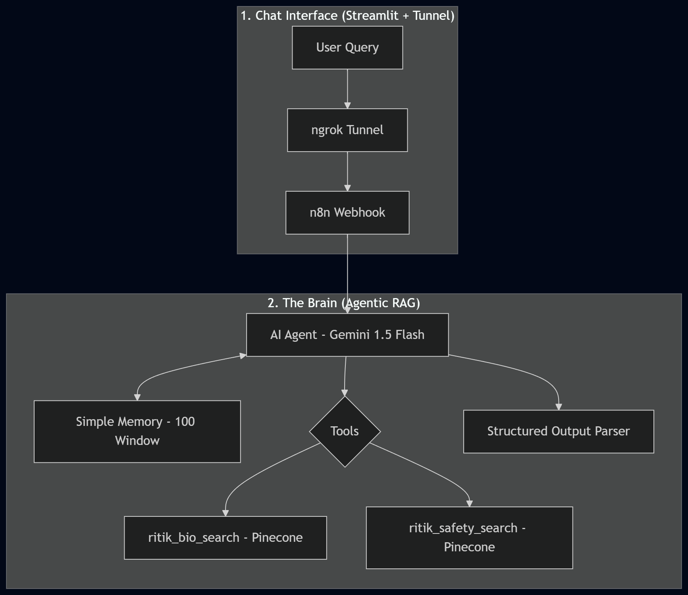

# 🤖 Me.io — The Digital Surrogate

> **"ATS ghosting is a data problem. I solved it with a production-grade Agentic ecosystem that doesn't just talk—it hunts, learns, and personalizes."**



## 📋 Project Overview
**Me.io** is a self-hosted, multi-flow agentic ecosystem orchestrated via **n8n** and running on a **Raspberry Pi 5**. It transitions my professional presence from a static PDF to an active, 24/7 technical surrogate. 

Unlike standard "wrappers," Me.io manages four distinct automated workstreams to handle the entire lifecycle of job hunting and professional engagement.

---

## 🚀 The Four Core Engines

### 1. The Agentic RAG Chatbot (The Surrogate)
The "front office." A reasoning agent that handles technical interviews and bio-queries.
* **Logic:** Uses a dual-tool setup to query separate Pinecone namespaces.
* **Governance:** A "Security First" logic gate checks **GDPR & Cybersecurity protocols** before disclosing PII or system prompts.
* **Tech:** Gemini 1.5 Flash, Pinecone, n8n Agent Node.

### 2. Recruiter Intelligence (The Hunter)
A proactive lead-generation pipeline.
* **Logic:** Searches the **Apollo.io** index for UK-based Technical Recruiters and Talent Managers at target companies. 
* **Action:** Reveals verified emails, cleans the data, and synchronizes leads to a Google Sheets CRM with built-in rate-limiting safety delays.

### 3. Real-Time Data Ingestion (The Learner)
Ensures the surrogate is never outdated.
* **Logic:** Watches a specific **Google Drive** folder for new research papers, certifications, or project summaries.
* **Action:** Automatically downloads, extracts text from PDFs, generates embeddings, and updates the Pinecone vector index.

### 4. Application Personalizer (The Closer)
Customized outreach at scale.
* **Logic:** Triggered by a job application form submission. Matches the specific recruiter for that role via Apollo.
* **Action:** Uses an LLM chain to rewrite CV bullets for that specific JD and generates a **unique QR code** (via QuickChart) leading to a personalized landing page.

---

## 🛠️ Engineering Stack & Optimization
* **Orchestration:** n8n (Self-hosted Docker container)
* **Compute:** Raspberry Pi 5 (8GB) optimized with **ZRAM** and hard Docker resource limits (`--memory="1.5g"`).
* **Memory:** Pinecone (Vector RAG) + n8n Window Buffer (Conversation memory).
* **Networking:** Secure **ngrok tunnel** providing an encrypted bridge to home hardware.

---

## 🧠 Technical Wins
* **High-Stakes Data:** Built to reflect my background managing **22M+ transaction records** at **Deloitte USI**.
* **Metrics-Driven:** Capable of defending my MSc research on Multi-modal AI (BERT-ResNet fusion) and my achieved **0.82 F1 score**.
* **Architecture Rigor:** Implemented `split-in-batches` logic and `wait` nodes to handle API quotas effectively on a self-hosted node.

---

## 🏗️ Visualizing the Architecture

### System Logic & RAG Flow


### Recruiter Hunter & Lead Gen


### Real-Time Ingestion


---

## 🛠️ Deployment

1.  **Clone & Configure:**
    ```bash
    git clone [https://github.com/Foxtrot123-png/Me.io](https://github.com/Foxtrot123-png/Me.io)
    
    cd Me.io
    ```
2.  **Import Workflows:** Import the `n8n_workflow_template.json` into n8n to instantly deploy all 4 flows.
3.  **Docker Up:**
    ```bash
    docker run -d --name n8n --memory="1.5g" --cpus="1.5" --restart always -p 5678:5678 n8nio/n8n
    ```

---

## 📧 Contact
* **Email:** [ritikmohapatra94@gmail.com](mailto:ritikmohapatra94@gmail.com)
* **Live App:** [ritik-ai.streamlit.app](https://ritik-ai-twin.streamlit.app/)
* **LinkedIn:** [Ritik](https://www.linkedin.com/in/ritik-r-mohapatra/)
